# Enums and Workflow

Two things this document does that [`field-reference.md`](field-reference.md)'s flat enum
appendix doesn't: it shows the **transitions** for every enum that drives a state machine (which
function moves it, per [`service-layer-logic.md`](service-layer-logic.md)), and it traces the
**end-to-end workflow** those state machines form together — one candidate's path from account
creation to a published result.

94 enums total. 23 of them are state machines (an entity's `status`/`outcome` field, changing over
time); 4 are live oscillating indicators (flip between a couple of states, no real lifecycle); the
remaining 67 are closed vocabularies with no transitions — a type, a severity, a reason code.

Every transition below is traceable to a numbered function in `service-layer-logic.md` (e.g.
`§8.1` = Module 8, function 1). Where a transition exists in the model but isn't wired to an
explicit function in that document, it's marked **(gap)** — called out rather than papered over.

---

## Contents

- [Part 1 — State machines](#part-1--state-machines)
- [Part 2 — Live status indicators](#part-2--live-status-indicators)
- [Part 3 — Classification & config enums, by module](#part-3--classification--config-enums-by-module)
- [Part 4 — The end-to-end workflow](#part-4--the-end-to-end-workflow)

---

## Part 1 — State machines

### `UserStatus` — `User.status`

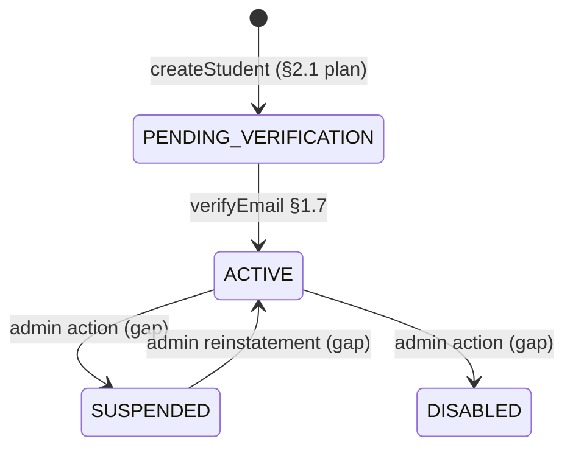
```mermaid
stateDiagram-v2
    [*] --> PENDING_VERIFICATION: createStudent (§2.1 plan)
    PENDING_VERIFICATION --> ACTIVE: verifyEmail §1.7
    ACTIVE --> SUSPENDED: admin action (gap)
    ACTIVE --> DISABLED: admin action (gap)
    SUSPENDED --> ACTIVE: admin reinstatement (gap)
```
`PENDING_VERIFICATION` and non-`ACTIVE` states both fail closed at login (§1.1 step 2) — the two
disabled-ish states collapse to the same `LoginOutcome.ACCOUNT_DISABLED`, but stay distinct
statuses so an admin can tell "never verified" from "suspended" from "disabled" at a glance.

### `ApiClientStatus` — `ApiClient.status`

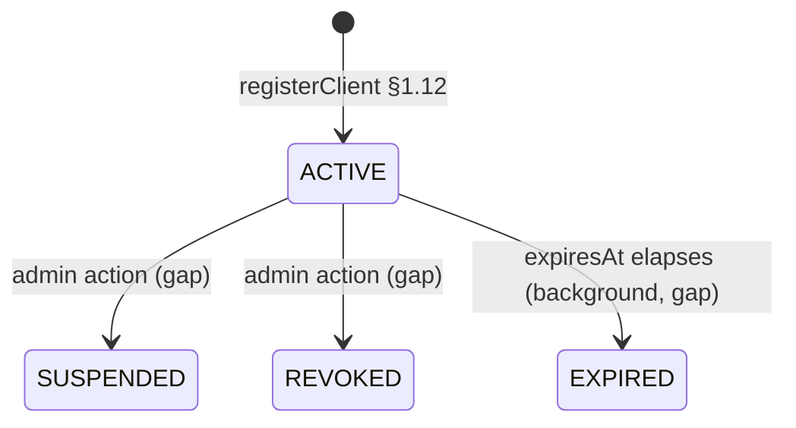
```mermaid
stateDiagram-v2
    [*] --> ACTIVE: registerClient §1.12
    ACTIVE --> SUSPENDED: admin action (gap)
    ACTIVE --> REVOKED: admin action (gap)
    ACTIVE --> EXPIRED: expiresAt elapses (background, gap)
```
`authenticate` (§1.13) checks `status = ACTIVE` before anything else — every other state is a
rejection, and the model doesn't distinguish *why* at the caller-facing level (all read the same
"unauthorized").

### `PaymentCardStatus` — `PaymentCard.status`

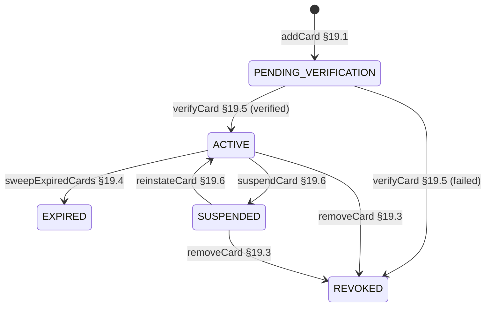
```mermaid
stateDiagram-v2
    [*] --> PENDING_VERIFICATION: addCard §19.1
    PENDING_VERIFICATION --> ACTIVE: verifyCard §19.5 (verified)
    PENDING_VERIFICATION --> REVOKED: verifyCard §19.5 (failed)
    ACTIVE --> EXPIRED: sweepExpiredCards §19.4
    ACTIVE --> SUSPENDED: suspendCard §19.6
    SUSPENDED --> ACTIVE: reinstateCard §19.6
    ACTIVE --> REVOKED: removeCard §19.3
    SUSPENDED --> REVOKED: removeCard §19.3
```
`REVOKED` never deletes the row — a past charge must keep a valid reference to the card that was
actually used at the time; `revokedReason` distinguishes a candidate's own removal from an admin
invalidation. A card is never chargeable straight off `addCard` — `verifyCard` is the only path
off `PENDING_VERIFICATION`, and resolves it one way or the other rather than leaving it pending.
`SUSPENDED` is reversible by design (a fraud hold that clears); `REVOKED` is not.

### `PaymentTransactionStatus` — `PaymentTransaction.status`

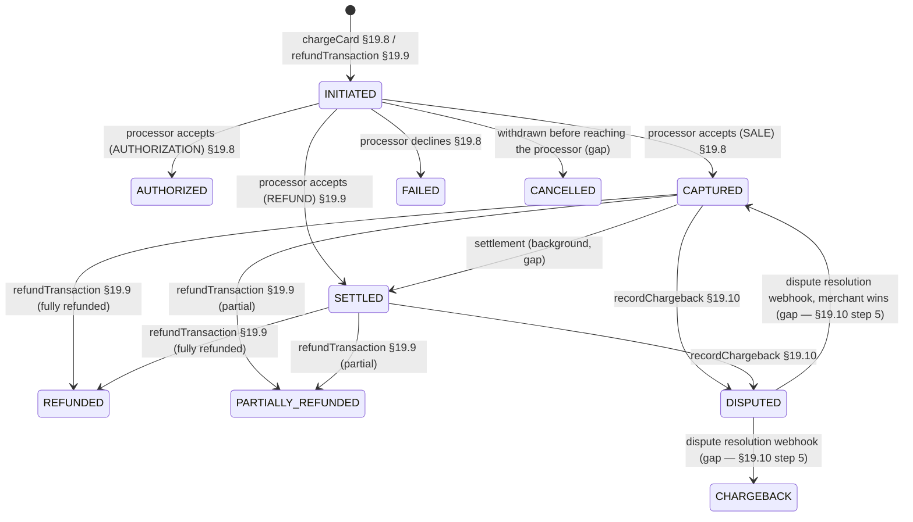
```mermaid
stateDiagram-v2
    [*] --> INITIATED: chargeCard §19.8 / refundTransaction §19.9
    INITIATED --> AUTHORIZED: processor accepts (AUTHORIZATION) §19.8
    INITIATED --> CAPTURED: processor accepts (SALE) §19.8
    INITIATED --> SETTLED: processor accepts (REFUND) §19.9
    INITIATED --> FAILED: processor declines §19.8
    CAPTURED --> SETTLED: settlement (background, gap)
    CAPTURED --> REFUNDED: refundTransaction §19.9 (fully refunded)
    CAPTURED --> PARTIALLY_REFUNDED: refundTransaction §19.9 (partial)
    SETTLED --> REFUNDED: refundTransaction §19.9 (fully refunded)
    SETTLED --> PARTIALLY_REFUNDED: refundTransaction §19.9 (partial)
    CAPTURED --> DISPUTED: recordChargeback §19.10
    SETTLED --> DISPUTED: recordChargeback §19.10
    DISPUTED --> CHARGEBACK: dispute resolution webhook (gap — §19.10 step 5)
    DISPUTED --> CAPTURED: dispute resolution webhook, merchant wins (gap — §19.10 step 5)
    INITIATED --> CANCELLED: withdrawn before reaching the processor (gap)
```
This is the same enum `ExamPaymentCharge.status` uses — a charge's lifecycle is this same shape,
driven by `payCharge` (§19.13) and `refundCharge` (§19.14) rather than `chargeCard`/
`refundTransaction` directly, so it isn't drawn as a second diagram. `PARTIALLY_REFUNDED` vs
`REFUNDED` is decided by comparing `amountRefundedMinor` to `amountMinor` after each refund, not
by a separate flag. The dispute-resolution webhook that finally resolves `DISPUTED` one way or
the other is honestly a gap — §19.10 names that it must happen without specifying the function
that does it.

### `ExamStatus` — `Exam.status`

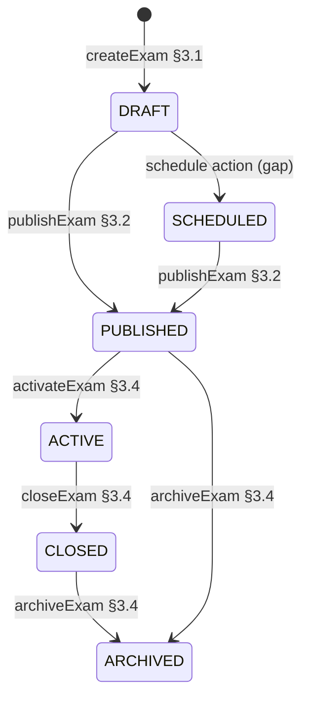
```mermaid
stateDiagram-v2
    [*] --> DRAFT: createExam §3.1
    DRAFT --> SCHEDULED: schedule action (gap)
    DRAFT --> PUBLISHED: publishExam §3.2
    SCHEDULED --> PUBLISHED: publishExam §3.2
    PUBLISHED --> ACTIVE: activateExam §3.4
    ACTIVE --> CLOSED: closeExam §3.4
    CLOSED --> ARCHIVED: archiveExam §3.4
    PUBLISHED --> ARCHIVED: archiveExam §3.4
```
Structure (sections/questions/policy) is only mutable in `DRAFT`; every other state accepts
non-structural edits only, or forces `updateExam` (§3.3) to fork a new `version` instead of
mutating. Nothing in `service-layer-logic.md` names what moves `DRAFT → SCHEDULED` — presumably
just "an `opensAt` is set for the future," but that's an inference, not a specified call.

### `QuestionStatus` — `Question.status`

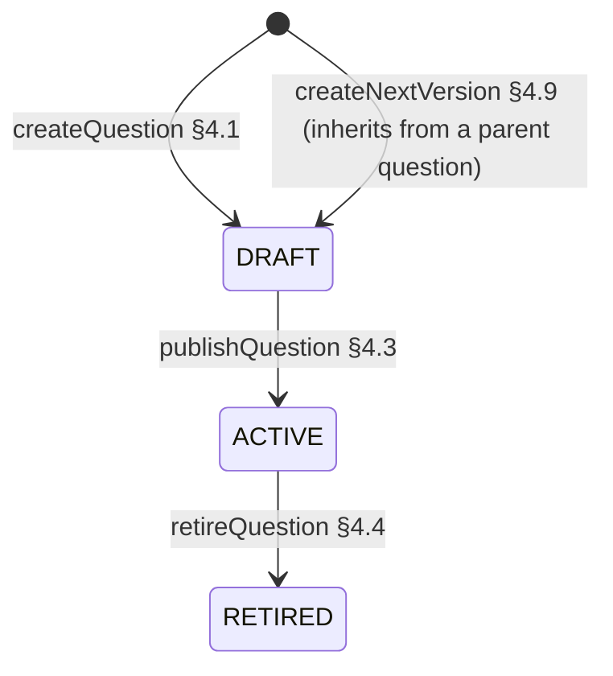
```mermaid
stateDiagram-v2
    [*] --> DRAFT: createQuestion §4.1
    [*] --> DRAFT: createNextVersion §4.9 (inherits from a parent question)
    DRAFT --> ACTIVE: publishQuestion §4.3
    ACTIVE --> RETIRED: retireQuestion §4.4
```
One-way past `DRAFT`. `RETIRED` is terminal by design — never deleted, never reactivated. A
question that needs a fix isn't edited in place (that would rewrite what past attempts are on
record as having seen) — `createNextVersion` inherits everything from the parent into a fresh
`DRAFT` row (`Question.parentQuestionId` points back at it), and the caller retires the parent
once the new version is actually placed into an exam.

### `AssignmentStatus` — `ExamAssignment.status`

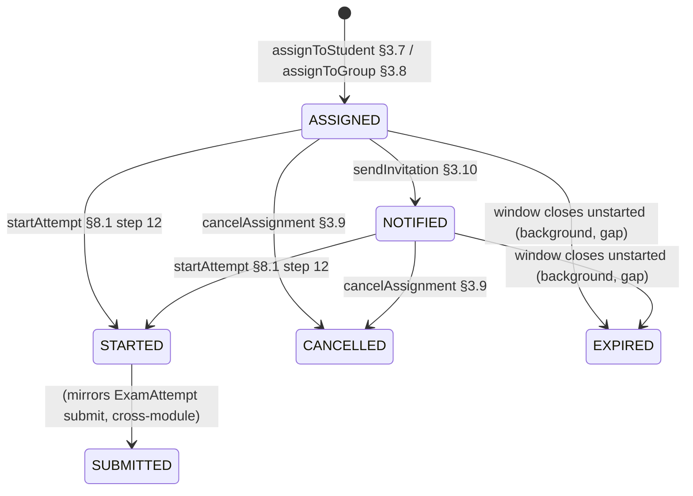
```mermaid
stateDiagram-v2
    [*] --> ASSIGNED: assignToStudent §3.7 / assignToGroup §3.8
    ASSIGNED --> NOTIFIED: sendInvitation §3.10
    ASSIGNED --> STARTED: startAttempt §8.1 step 12
    NOTIFIED --> STARTED: startAttempt §8.1 step 12
    STARTED --> SUBMITTED: (mirrors ExamAttempt submit, cross-module)
    ASSIGNED --> CANCELLED: cancelAssignment §3.9
    NOTIFIED --> CANCELLED: cancelAssignment §3.9
    ASSIGNED --> EXPIRED: window closes unstarted (background, gap)
    NOTIFIED --> EXPIRED: window closes unstarted (background, gap)
```
`cancelAssignment` explicitly refuses to fire once `SUBMITTED` (§3.9 precondition) — cancellation
is for entitlements never used, not a way to erase a sitting that happened.

### `InvitationStatus` — `ExamInvitation.status`

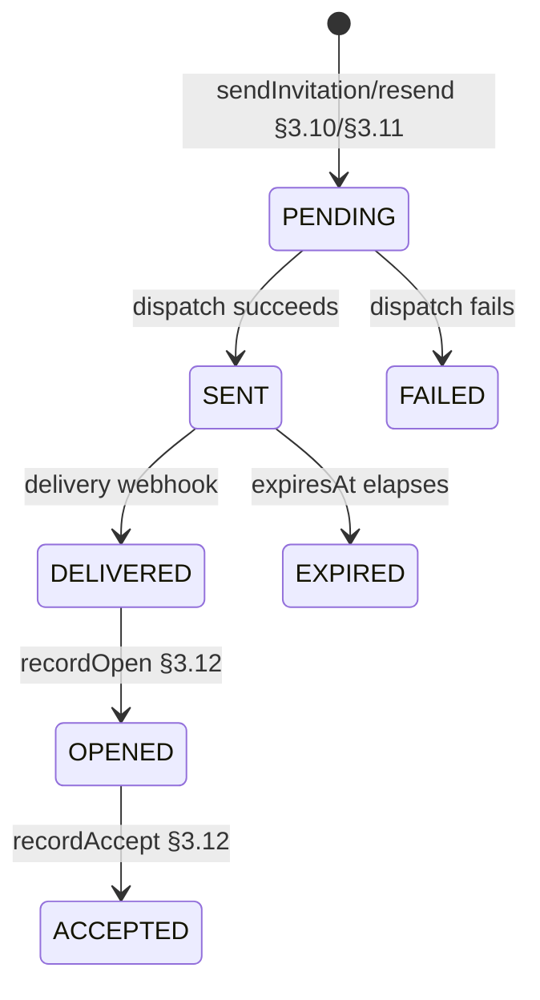
```mermaid
stateDiagram-v2
    [*] --> PENDING: sendInvitation/resend §3.10/§3.11
    PENDING --> SENT: dispatch succeeds
    PENDING --> FAILED: dispatch fails
    SENT --> DELIVERED: delivery webhook
    DELIVERED --> OPENED: recordOpen §3.12
    OPENED --> ACCEPTED: recordAccept §3.12
    SENT --> EXPIRED: expiresAt elapses
```
A resend never edits this state machine in place — it starts a brand-new `ExamInvitation` row
with its own `sequenceNo` (§3.11), so an old invitation's `EXPIRED`/`FAILED` status is left
exactly as it was.

### `SystemCheckStatus` — `SystemCheck.status`

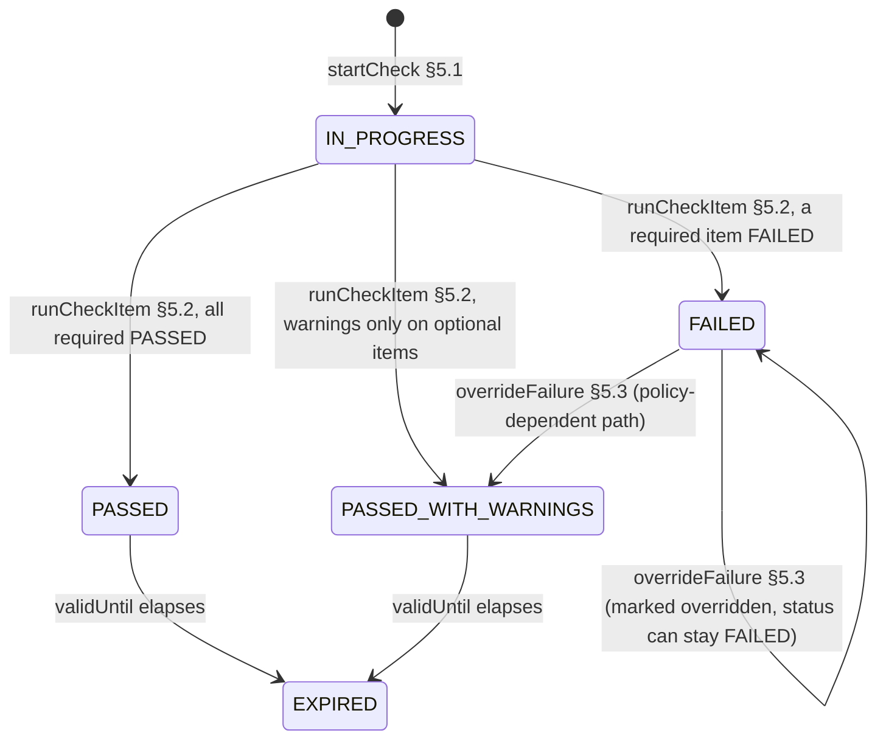
```mermaid
stateDiagram-v2
    [*] --> IN_PROGRESS: startCheck §5.1
    IN_PROGRESS --> PASSED: runCheckItem §5.2, all required PASSED
    IN_PROGRESS --> PASSED_WITH_WARNINGS: runCheckItem §5.2, warnings only on optional items
    IN_PROGRESS --> FAILED: runCheckItem §5.2, a required item FAILED
    FAILED --> FAILED: overrideFailure §5.3 (marked overridden, status can stay FAILED)
    FAILED --> PASSED_WITH_WARNINGS: overrideFailure §5.3 (policy-dependent path)
    PASSED --> EXPIRED: validUntil elapses
    PASSED_WITH_WARNINGS --> EXPIRED: validUntil elapses
```
This is the one status the model explicitly allows to look "successful" while still carrying a
scar (`overridden = true`) — `startAttempt`'s gate (§8.1 step 6) checks both the status *and* the
override flag, not status alone.

### `VerificationStatus` — `IdentityVerification.status`

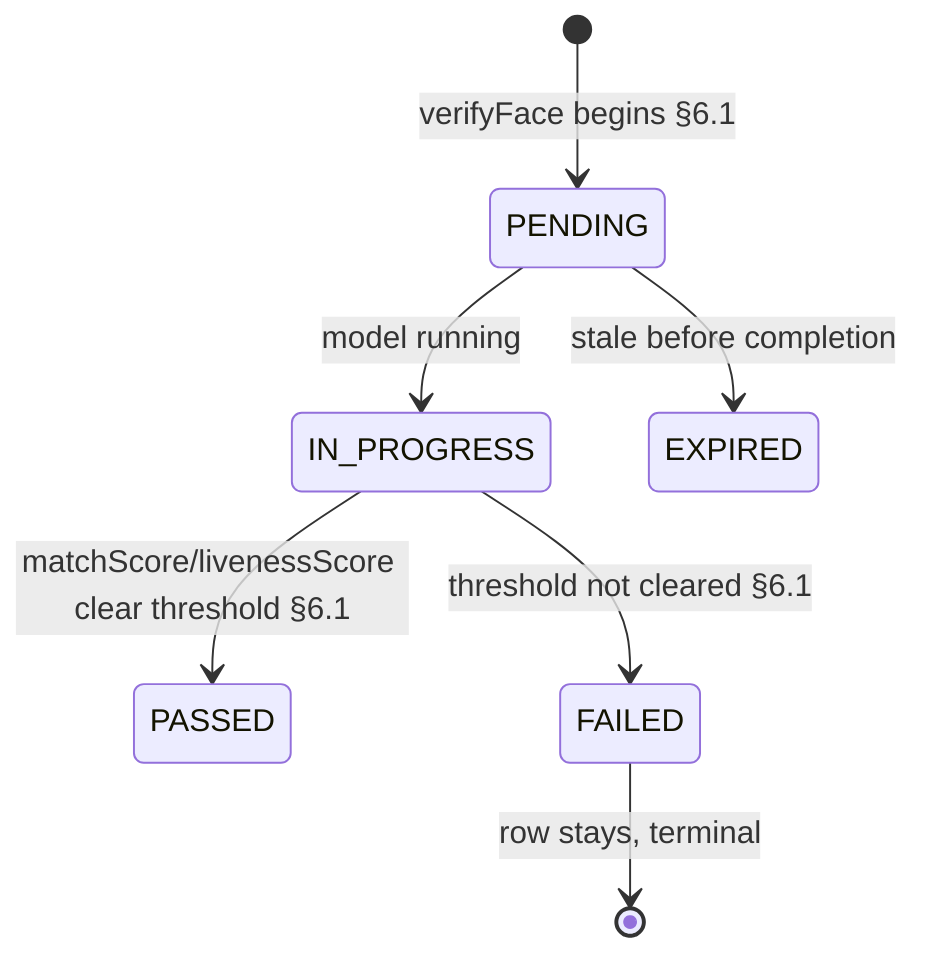
```mermaid
stateDiagram-v2
    [*] --> PENDING: verifyFace begins §6.1
    PENDING --> IN_PROGRESS: model running
    IN_PROGRESS --> PASSED: matchScore/livenessScore clear threshold §6.1
    IN_PROGRESS --> FAILED: threshold not cleared §6.1
    FAILED --> [*]: row stays, terminal
    PENDING --> EXPIRED: stale before completion
```
`FAILED` is terminal for *that row* — recovery isn't a status change, it's a **new row**:
`manualOverride` (§6.2) inserts a second `IdentityVerification` with
`status = MANUAL_OVERRIDE`, `method = MANUAL_PROCTOR`. The failure is never erased.

### `AttemptStatus` — `ExamAttempt.status`

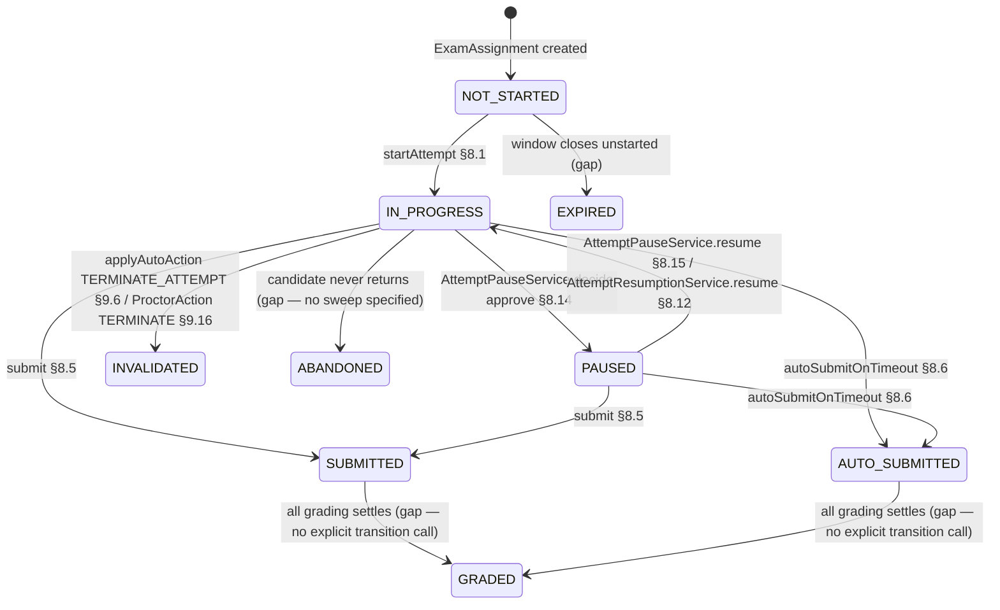
```mermaid
stateDiagram-v2
    [*] --> NOT_STARTED: ExamAssignment created
    NOT_STARTED --> IN_PROGRESS: startAttempt §8.1
    NOT_STARTED --> EXPIRED: window closes unstarted (gap)
    IN_PROGRESS --> PAUSED: AttemptPauseService.decide approve §8.14
    PAUSED --> IN_PROGRESS: AttemptPauseService.resume §8.15 / AttemptResumptionService.resume §8.12
    IN_PROGRESS --> SUBMITTED: submit §8.5
    PAUSED --> SUBMITTED: submit §8.5
    IN_PROGRESS --> AUTO_SUBMITTED: autoSubmitOnTimeout §8.6
    PAUSED --> AUTO_SUBMITTED: autoSubmitOnTimeout §8.6
    IN_PROGRESS --> INVALIDATED: applyAutoAction TERMINATE_ATTEMPT §9.6 / ProctorAction TERMINATE §9.16
    IN_PROGRESS --> ABANDONED: candidate never returns (gap — no sweep specified)
    SUBMITTED --> GRADED: all grading settles (gap — no explicit transition call)
    AUTO_SUBMITTED --> GRADED: all grading settles (gap — no explicit transition call)
```
The spine of the whole model, and the one with the most honest gaps: `service-layer-logic.md`
specifies exactly how an attempt gets *into* every state except `ABANDONED` and `GRADED` — those
two exist on the enum but nothing in the current logic explicitly sets them. A real
implementation needs (a) an idle-timeout sweep distinct from `autoSubmitOnTimeout` for
`ABANDONED`, and (b) `AnswerService.gradeAutomatically` (§8.9) or its manual-grading counterpart
to flip `ExamAttempt.status` to `GRADED` once every `AttemptAnswer.gradingStatus` on the attempt
reaches `GRADED`.

### `GradingStatus` — `AttemptAnswer.gradingStatus`

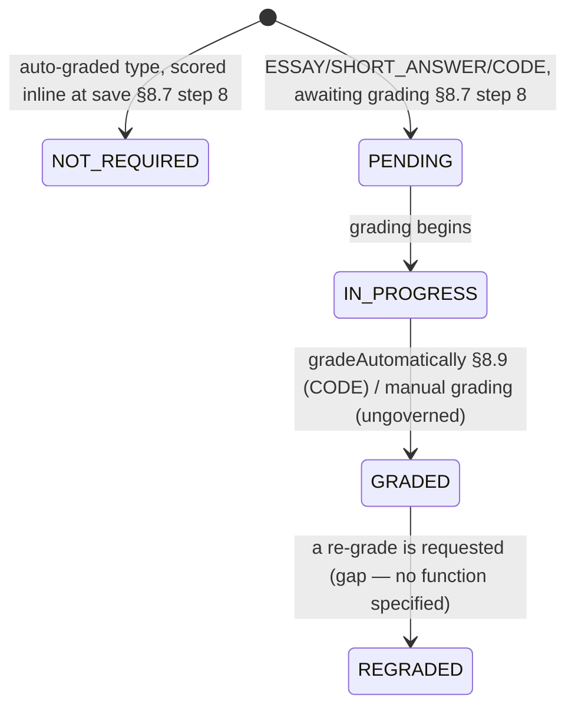
```mermaid
stateDiagram-v2
    [*] --> NOT_REQUIRED: auto-graded type, scored inline at save §8.7 step 8
    [*] --> PENDING: ESSAY/SHORT_ANSWER/CODE, awaiting grading §8.7 step 8
    PENDING --> IN_PROGRESS: grading begins
    IN_PROGRESS --> GRADED: gradeAutomatically §8.9 (CODE) / manual grading (ungoverned)
    GRADED --> REGRADED: a re-grade is requested (gap — no function specified)
```
Only `CODE` resolves automatically from `CodeExecutionResult` (§8.9); `ESSAY`/`SHORT_ANSWER`
sitting at `PENDING` is exactly the queue a human grader works from, but no
`GradeManuallyService`-equivalent exists yet in the plan.

### `PauseRequestStatus` — `AttemptPauseRequest.status`

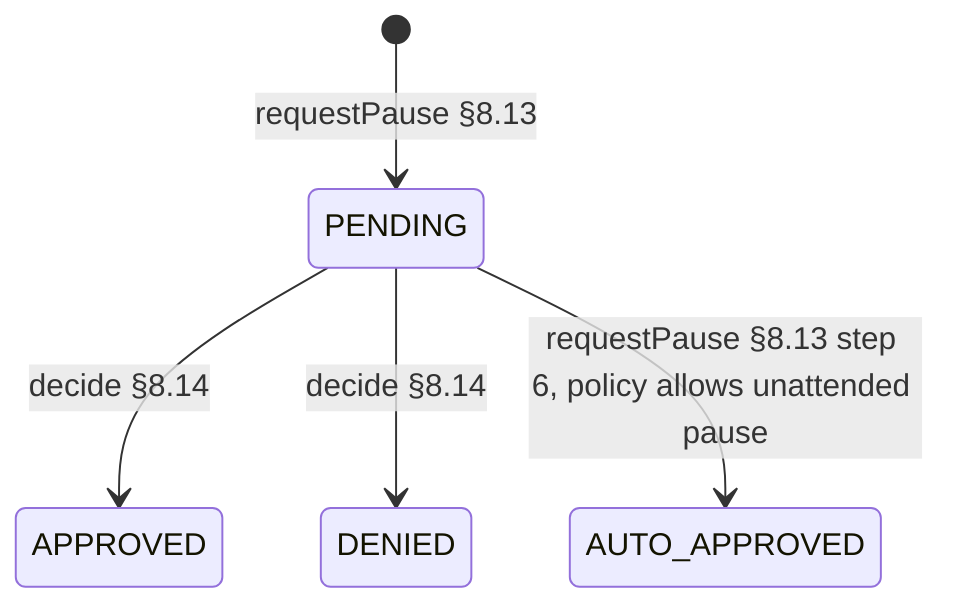
```mermaid
stateDiagram-v2
    [*] --> PENDING: requestPause §8.13
    PENDING --> APPROVED: decide §8.14
    PENDING --> DENIED: decide §8.14
    PENDING --> AUTO_APPROVED: requestPause §8.13 step 6, policy allows unattended pause
```
Only one row may sit at `PENDING` per attempt at a time (§8.13 invariant) — a second request
while one is open is rejected outright, never queued behind the first.

### `ExcelSessionStatus` — `ExcelSession.status`

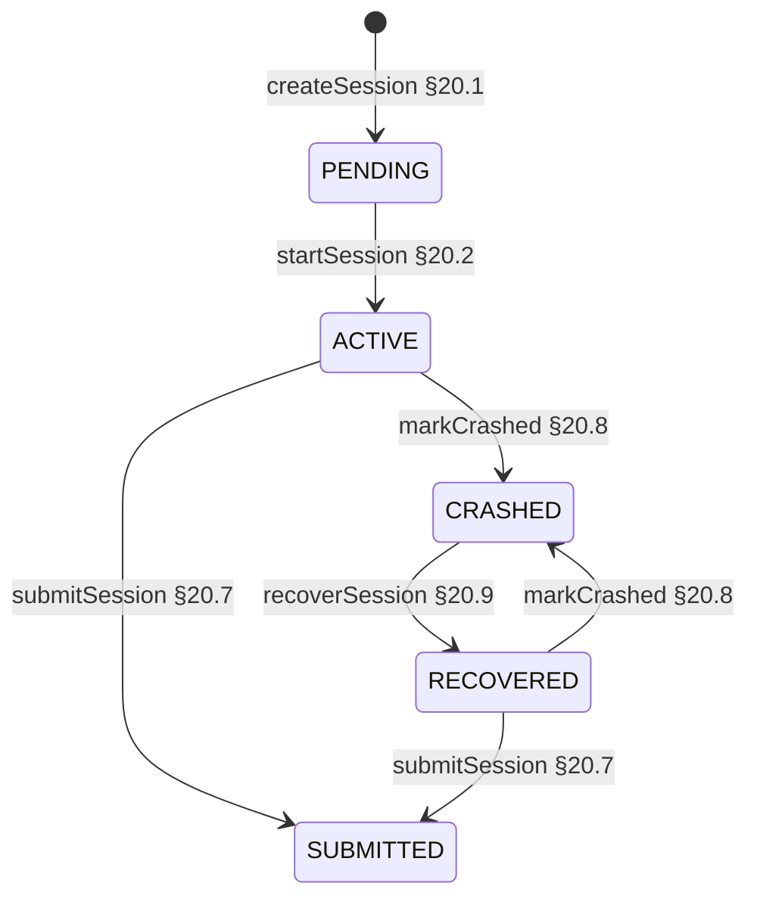
```mermaid
stateDiagram-v2
    [*] --> PENDING: createSession §20.1
    PENDING --> ACTIVE: startSession §20.2
    ACTIVE --> SUBMITTED: submitSession §20.7
    ACTIVE --> CRASHED: markCrashed §20.8
    RECOVERED --> CRASHED: markCrashed §20.8
    RECOVERED --> SUBMITTED: submitSession §20.7
    CRASHED --> RECOVERED: recoverSession §20.9
```
`RECOVERED` behaves exactly like `ACTIVE` for every further operation (cell edits, sheet
operations, macro runs, snapshots) — it's a distinct value purely so the audit trail shows this
session survived a crash, not a functional gate. `integrityStatus` is always set by the time
`submitSession` finishes (§20.7 step 4), never left null on a `SUBMITTED` session.

### `ProctoringSessionStatus` — `ProctoringSession.status`

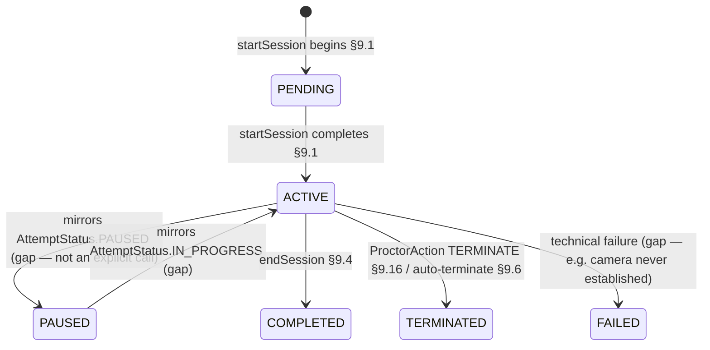
```mermaid
stateDiagram-v2
    [*] --> PENDING: startSession begins §9.1
    PENDING --> ACTIVE: startSession completes §9.1
    ACTIVE --> PAUSED: mirrors AttemptStatus.PAUSED (gap — not an explicit call)
    PAUSED --> ACTIVE: mirrors AttemptStatus.IN_PROGRESS (gap)
    ACTIVE --> COMPLETED: endSession §9.4
    ACTIVE --> TERMINATED: ProctorAction TERMINATE §9.16 / auto-terminate §9.6
    ACTIVE --> FAILED: technical failure (gap — e.g. camera never established)
```
Deliberately separate from `AttemptStatus`: an attempt can be `PAUSED` for a reason that has
nothing to do with supervision (e.g. a candidate-requested break under a policy that keeps
recording running), so the two state machines are correlated, not identical.

### `DeviceTrustLevel` — `DeviceTrustRecord.trustLevel`

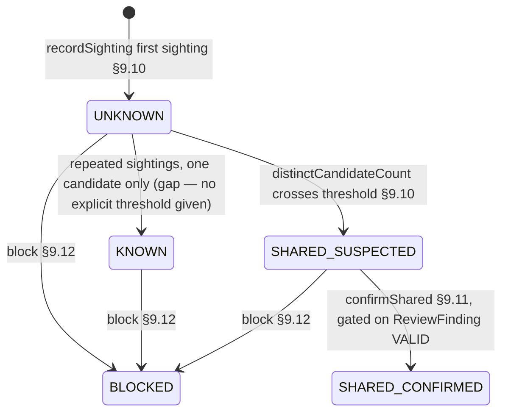
```mermaid
stateDiagram-v2
    [*] --> UNKNOWN: recordSighting first sighting §9.10
    UNKNOWN --> KNOWN: repeated sightings, one candidate only (gap — no explicit threshold given)
    UNKNOWN --> SHARED_SUSPECTED: distinctCandidateCount crosses threshold §9.10
    SHARED_SUSPECTED --> SHARED_CONFIRMED: confirmShared §9.11, gated on ReviewFinding VALID
    UNKNOWN --> BLOCKED: block §9.12
    KNOWN --> BLOCKED: block §9.12
    SHARED_SUSPECTED --> BLOCKED: block §9.12
```
`SHARED_CONFIRMED` is the one state in this entire document that a machine is structurally
barred from reaching alone — it requires a human `ReviewFinding.verdict = VALID` as a
precondition (§9.11), by design: the AI does not get to declare intent.

### `ReviewCaseStatus` — `ReviewCase.status`

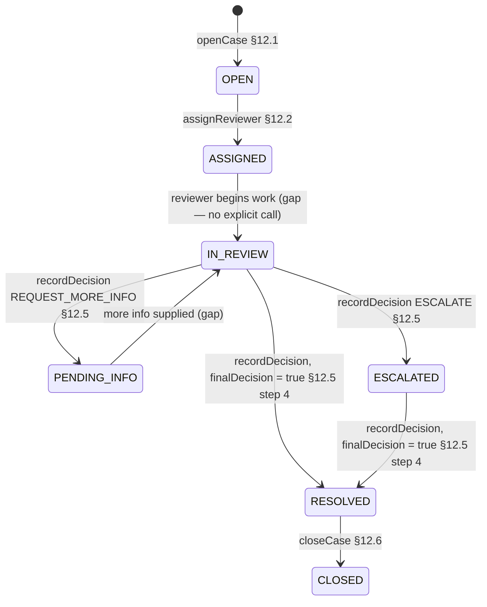
```mermaid
stateDiagram-v2
    [*] --> OPEN: openCase §12.1
    OPEN --> ASSIGNED: assignReviewer §12.2
    ASSIGNED --> IN_REVIEW: reviewer begins work (gap — no explicit call)
    IN_REVIEW --> PENDING_INFO: recordDecision REQUEST_MORE_INFO §12.5
    PENDING_INFO --> IN_REVIEW: more info supplied (gap)
    IN_REVIEW --> ESCALATED: recordDecision ESCALATE §12.5
    IN_REVIEW --> RESOLVED: recordDecision, finalDecision = true §12.5 step 4
    ESCALATED --> RESOLVED: recordDecision, finalDecision = true §12.5 step 4
    RESOLVED --> CLOSED: closeCase §12.6
```
Not unique per attempt (§12.1 invariant) — a `CLOSED` case can be followed by a brand-new `OPEN`
one on the same attempt if an appeal reopens the question, and both histories survive side by
side rather than one overwriting the other.

### `ResultStatus` — `ExamResult.status`

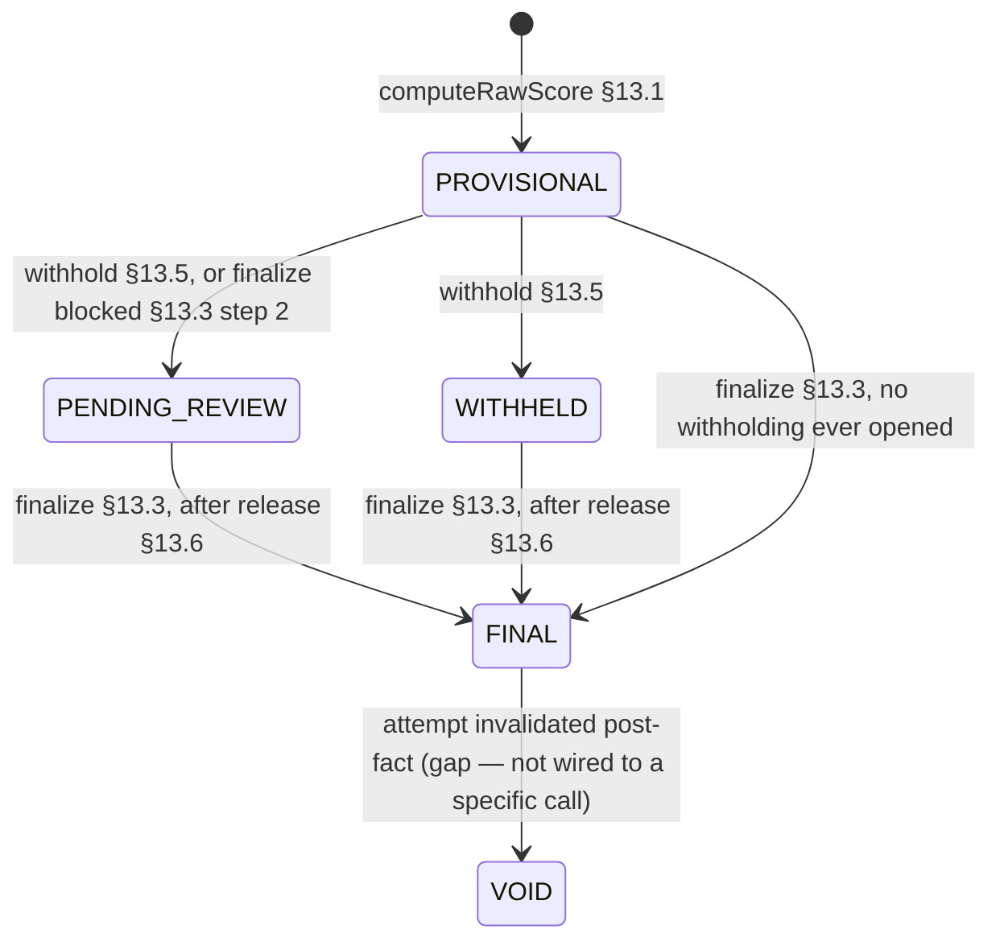
```mermaid
stateDiagram-v2
    [*] --> PROVISIONAL: computeRawScore §13.1
    PROVISIONAL --> PENDING_REVIEW: withhold §13.5, or finalize blocked §13.3 step 2
    PROVISIONAL --> WITHHELD: withhold §13.5
    PENDING_REVIEW --> FINAL: finalize §13.3, after release §13.6
    WITHHELD --> FINAL: finalize §13.3, after release §13.6
    PROVISIONAL --> FINAL: finalize §13.3, no withholding ever opened
    FINAL --> VOID: attempt invalidated post-fact (gap — not wired to a specific call)
```
`finalize` is unconditionally blocked while *any* `ResultWithholding` on the result has
`releasedAt = null` (§13.3 invariant) — not just the most recent one, every open one.

### `IntegrityStatus` — `ExamResult.integrityStatus`

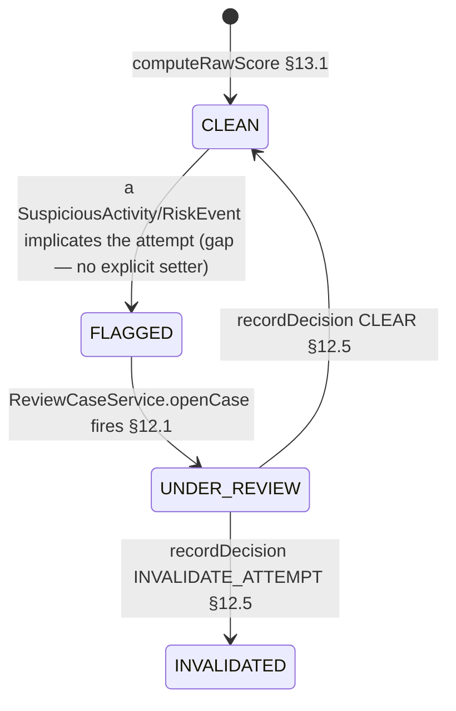
```mermaid
stateDiagram-v2
    [*] --> CLEAN: computeRawScore §13.1
    CLEAN --> FLAGGED: a SuspiciousActivity/RiskEvent implicates the attempt (gap — no explicit setter)
    FLAGGED --> UNDER_REVIEW: ReviewCaseService.openCase fires §12.1
    UNDER_REVIEW --> INVALIDATED: recordDecision INVALIDATE_ATTEMPT §12.5
    UNDER_REVIEW --> CLEAN: recordDecision CLEAR §12.5
```
Runs alongside `ResultStatus`, not inside it — a result can be `FINAL` and `FLAGGED`
simultaneously if `Exam.holdResultsForReview = false`, which is exactly the configuration that
lets a score reach a candidate before an integrity question about it is settled.

### `ReportStatus` — `ProctoringReport.status`

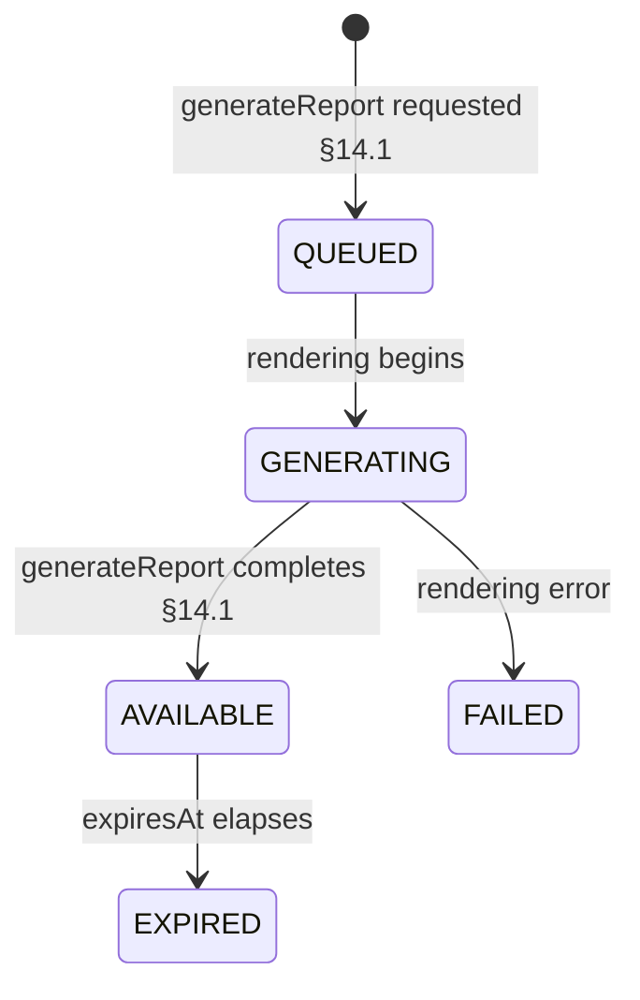
```mermaid
stateDiagram-v2
    [*] --> QUEUED: generateReport requested §14.1
    QUEUED --> GENERATING: rendering begins
    GENERATING --> AVAILABLE: generateReport completes §14.1
    GENERATING --> FAILED: rendering error
    AVAILABLE --> EXPIRED: expiresAt elapses
```
A regenerate (§14.2) never reuses this state machine on the same row — it inserts a whole new
`ProctoringReport` at `version + 1`, `QUEUED` again from scratch; the old row's `AVAILABLE`
status is untouched.

### `NotificationStatus` — `Notification.status`

```mermaid
stateDiagram-v2
    [*] --> PENDING: send §15.1
    PENDING --> QUEUED: deferred by NotificationSuppressionService §15.3 (quiet hours / rate limit)
    PENDING --> CANCELLED: suppressed by opt-out or hard rule §15.3
    PENDING --> SENT: dispatch succeeds
    QUEUED --> SENT: scheduledFor elapses, dispatch succeeds
    SENT --> DELIVERED: delivery webhook
    DELIVERED --> OPENED: open tracked
    SENT --> FAILED: dispatch fails, retryCount exceeds bound §15.1 step 11
```
`HIGH_RISK_ALERT` and `SYSTEM_ALERT` skip the suppression check entirely (§15.3 precondition) —
those two types never pass through the `QUEUED`/`CANCELLED` branch no matter what suppression
rules exist.

### `ModelVersionStatus` — `AiModelVersion.status`

```mermaid
stateDiagram-v2
    [*] --> DRAFT: registerVersion §17.1
    DRAFT --> CANDIDATE: promote §17.2
    CANDIDATE --> SHADOW: promote §17.2
    SHADOW --> ACTIVE: promote §17.2, gated by ShadowEvaluationService.evaluate §10.3
    ACTIVE --> DEPRECATED: promote §17.2, new version reaches ACTIVE
    DEPRECATED --> RETIRED: promote §17.2
```
`SHADOW` is the only state where a version generates real `AiDetection` rows without ever being
allowed to raise a `ProctoringEvent` or influence `autoAction` (§10.1 step 5) — it exists purely
to be measured against the active version before anyone trusts it.

### `EvidenceUploadStatus` — `EvidenceFile.uploadStatus`

```mermaid
stateDiagram-v2
    [*] --> PENDING: captureEvidence begins §9.7
    PENDING --> UPLOADING: upload starts
    UPLOADING --> UPLOADED: captureEvidence completes §9.7
    UPLOADING --> FAILED: upload error
    UPLOADING --> QUARANTINED: post-upload checksum mismatch §9.7 step 10
    UPLOADED --> PURGED: purgeExpired §9.9
```
`QUARANTINED` exists because `captureEvidence` explicitly compares the checksum computed before
upload against one recomputed after (§9.7 step 10) — a mismatch means the bytes changed in
transit, and that file must never silently become usable evidence.

---

## Part 2 — Live status indicators

Four enums don't have a "lifecycle" in the sense above — they flip back and forth as a live
signal, with no terminal state and no real notion of progress:

- **`CandidateLiveStatus`** (`LiveSessionStatus.candidateStatus`) — ACTIVE / IDLE / SUSPENDED,
  reflecting the candidate's own behavior right now. Set by `updateLiveStatus` (§9.3); nothing
  computes IDLE from an inactivity timer in the current plan — a real implementation needs that
  logic somewhere (a scheduled sweep, or derived from `lastActivityAt` on read).
- **`ConnectionStatus`** (`LiveSessionStatus.connectionStatus`) — the client-server transport
  link. Oscillates with network conditions; not driven by any of the numbered functions directly,
  just written by whatever heartbeat/websocket layer is watching the connection.
- **`StreamStatus`** (`LiveSessionStatus.cameraStatus` / `.microphoneStatus` / `.screenStatus`) —
  same enum, three independent fields, one per media stream.
- **`ProctorShiftOutcome`** (`ProctorShift.outcome`) — technically written once, at shift end
  (`endShift` §9.15 or `handOver` §9.14), so it's closer to a terminal marker than a live
  indicator, but it never feeds back into a further transition the way the 20 above do.

---

## Part 3 — Classification & config enums, by module

No transitions — each is a closed vocabulary a field picks one value from. Grouped by the module
that owns them, with what each is actually *for* in the workflow (not just what the constants
are — see `field-reference.md`'s appendix for the bare constant lists).

**Payment** — `PaymentProvider` (which PCI-compliant processor tokenized a card via `addCard`
§19.1, or moved money via `chargeCard` §19.8 — the processor holds the real card data, this
system only ever sees its token), `CardBrand` (the network, for display only — never affects how
a card is processed), `PaymentCardFunding` (credit/debit/prepaid/charge, from the processor's
card metadata — informational only), `PaymentCardholderVerification` (the CVV/AVS check results
`verifyCard` §19.5 records — feeds fraud review, never blocks verification on its own),
`PaymentTransactionType` (which kind of money movement one `PaymentTransaction` row is —
dispatches `chargeCard`/`refundTransaction`/`recordChargeback`'s different insert shapes, but
doesn't itself transition).

**Authentication & Access** — `MfaMethod` (which second factor `enrollMfa` §1.8 set up; drives
`verifyMfaCode`'s §1.2 dispatch), `LoginOutcome` (the one-shot result written to every
`LoginAttempt`, never transitions since each row is one attempt), `TokenPurpose` (discriminates
what a `SecurityToken` authorizes — `resetPassword`/`verifyEmail` both reject a token whose
purpose doesn't match).

**Student Groups** — `GroupType` (CLASS/COHORT/DEPARTMENT/PROGRAM/CUSTOM — no behavioral
difference in the plan, purely descriptive for reporting and UI grouping).

**Exam Definition** — `GradingMode` (AUTO/MANUAL/HYBRID, set on `Exam` and copied onto
`ExamResult` at `computeRawScore` §13.1 step 6 — carried as a record of how the exam was
configured to be graded, though nothing in the current logic branches on its value; a real
`gradeAutomatically`-vs-manual dispatch would read it), `InvitationChannel` (which transport
`sendInvitation` §3.10 dispatches through), `ExcelUiActionPolicy` (ALLOW/BLOCK/LOG, set per exam
on `ExcelPolicy.copyPastePolicy`/`cutDragFillPolicy` — enforced by the runtime UI itself, not by
any function in this document), `ExcelRecalcMode` (AUTOMATIC/MANUAL/ITERATIVE, read by
`startSession` §20.2 when it loads the workbook).

**Question Bank** — `QuestionType` (the eleven shapes a question can take; `publishQuestion` §4.3
validates completeness per type), `QuestionDifficulty` (the author's own declared difficulty,
set at `createQuestion` §4.1 — independent of, and never compared against, the *empirical*
`QuestionCalibration.difficultyIndex` §4.8 computes; reconciling the two is a natural extension
this plan doesn't specify),
`ProgrammingLanguage` (which compiler/runtime a `CODE` question's `CodeTestCase`s run under),
`TestCaseVisibility` (SAMPLE shown to the candidate before grading, HIDDEN used only for scoring),
`CalibrationFlag`/`CalibrationAction` (what a calibration run found, and what it recommends —
never what it does; a human still calls `retireQuestion` §4.4),
`ExcelWorkbookFileType` (the format of a SPREADSHEET question's uploaded template — informational,
never branches runtime behavior), `ExcelMacroPolicy` (OFF/SANDBOXED/ALLOWED_WHITELIST, the
question-level half of the macro gate `runMacro` §20.5 checks — the exam-level half is
`ExcelPolicy.macrosAllowed` above), `ExcelAnswerKind` (what kind of check one `ExcelCellBinding`
declares, and — reused on `ExcelGradeResult` — what kind `gradeAnswer` §20.10 actually applied;
the two can diverge when a structural check falls back to `MANUAL`).

**Pre-Exam System Check** — `SystemCheckType` (the thirteen checkable items; which ones are
required comes from the exam's `ProctoringPolicy`/`ExcelPolicy`, not the enum itself), `CheckResult`
(per-item outcome feeding `SystemCheck.status` §5.2).

**Excel Runtime** — `ExcelRuntimeEngine` (which spreadsheet engine hosts a session, selected by
`startSession` §20.2), `ExcelIntegrityStatus` (the one-shot verdict `submitSession` §20.7 writes
once, never transitioning afterward — the same shape as `LoginOutcome`), `ExcelSheetOperationType`
(classifies each append-only `ExcelSheetOperation` row `recordSheetOperation` §20.4 writes; a row
never changes type after being written).

**Identity Verification** — `VerificationMethod` (FACE_MATCH vs. MANUAL_PROCTOR vs. others —
`manualOverride` §6.2 always writes `MANUAL_PROCTOR`, never re-uses the failed method).

**Consent & Privacy** — no enums; `ConsentRecord`/`PrivacyNotice` are pure data with
`Instant`-typed lifecycle fields instead.

**Exam Session & Attempts** — `QuestionStateType` (navigation state per question — `markForReview`
§8.4 toggles `FLAGGED`, distinct from `AttemptAnswer.flaggedByCandidate`), `ResumptionReason`
(why `AttemptResumptionService.resume` §8.12 was needed — crash, network, reboot, power, or
proctor-initiated), `TimingAnomalyType` (which shape of implausible timing
`AnswerTimingAnomalyService.checkTiming` §8.10 flagged).

**Proctoring Sessions** — `ProctoringMode` (the exam-level policy setting that
`ProctoringSessionService.startSession` §9.1 snapshots onto the session at creation — changing the
policy later never touches sessions already running), `EventSeverity`/`EventSource` (every
`ProctoringEvent`'s classification — severity feeds `RiskScoringService` §11.1's factor lookup),
`AutoAction` (the escalation ladder `applyAutoAction` §9.6 picks from — `NONE` through
`TERMINATE_ATTEMPT`), `ProctoringEventType` (the 55-constant vocabulary every event is one of,
ten of them mirrored from `ExcelSessionService`/`ExcelGradingService` (§20.1–§20.10) into the same
stream every other signal feeds — see the full list in `field-reference.md`), `EvidenceKind` (what
an `EvidenceFile` actually is — snapshot, clip, document, log bundle, or one of four Excel
artefact kinds written by `takeSnapshot` §20.6), `EvidenceAccessAction` (what `viewEvidence` §9.8 logged
someone doing), `CustodyTransition` (the chain-of-custody step recorded by `captureEvidence` §9.7
and `purgeExpired` §9.9 — `PURGED` is the only one that's truly terminal), `ProctorActionType`
(WARN through NO_ACTION — what `ProctorActionService.recordAction` §9.16 recorded a live proctor
doing; `TERMINATE` is the one value that also requires a second signature under a two-person
approval policy).

**AI Detection** — `DetectionType` (FACE/OBJECT/BEHAVIOR/AUDIO — which detail table an
`AiDetection` row's findings live in), `GazeDirection`, `DetectedObjectClass`, `BehaviorType`,
`AudioEventType` (the specific finding vocabularies for each of the four detail tables),
`SuspiciousActivityType` (what `correlateWindow` §10.2 concluded from co-occurring signals),
`ActivityVerdict` (DETECTED until a human reviewer moves it — see `ItemVerdict` below, which is
the *reviewer's* verdict on the same activity, a distinct field on a distinct entity).

**Risk Engine** — `RiskLevel` (LOW/MEDIUM/HIGH/CRITICAL, the resolved band from
`RiskScoringService.computeScore` §11.1 step 5), `RiskRecommendation` (what that band advises —
ALLOW through REQUIRE_RETAKE), `RiskFactorTrigger` (what kind of signal a `RiskFactorConfig` rule
reacts to — an event, a detection, a device signal, an identity signal).

**Review System** — `ReviewPriority` (queue ordering for `ReviewCaseService.openCase` §12.1),
`ReviewDecisionType` (the seven actions a `recordDecision` §12.5 call can take — `GRANT_RETAKE`
is what `RetakeGrantService.grantRetake` requires as its own precondition), `ReviewOutcome` (the
settled label mirrored onto `ReviewCase.finalOutcome` once resolved), `ItemVerdict` (VALID /
FALSE_POSITIVE / NEEDS_INVESTIGATION / INCONCLUSIVE — a reviewer's per-item call via `addFinding`
§12.3; `FALSE_POSITIVE` on an `AI_DETECTION` item is the one thing that feeds
`ModelPerformanceMetric`), `ReviewItemKind` (which of five tables a `ReviewFinding.itemId` points
into).

**Exam Results** — `WithholdingReason` (why a `ResultWithholding` exists — risk threshold, open
case, pending manual grading, appeal, or an external hold).

**Proctoring Reports** — `ReportFormat` (PDF/HTML/JSON/ZIP_BUNDLE — what `generateReport` §14.1
actually rendered).

**Notifications** — `NotificationChannel` (transport — email/SMS/in-app/push/webhook),
`NotificationType` (the twelve triggers `send` §15.1 can fire for; only `HIGH_RISK_ALERT` and
`SYSTEM_ALERT` bypass suppression), `SuppressionKind` (which mechanism a `NotificationSuppression`
rule applies — quiet hours, opt-out, rate limit, or duplicate-content window).

**Audit** — `AuditAction` (the twenty-two consequential-write categories every `AuditLog` row
falls into; four of them — `SCORE_OVERRIDE`, `PERMISSION_CHANGE`, `CONFIG_CHANGE`,
`TERMINATE_ATTEMPT` — reject the call outright if `reason` is null, §16.1 step 2),
`AuditOutcome` (SUCCESS/FAILURE/DENIED, orthogonal to the action itself).

**AI Model Registry** — `ModelPurpose` (which of eleven jobs a model does, including
`EXCEL_ANOMALY_DETECTION` for scoring Excel editing patterns — a `ShadowEvaluation` §10.3 only
compares two versions of the *same* purpose), `MetricType` (the eight measurable dimensions
`recordMetric` §17.3 can log — precision through throughput), `ShadowRecommendation`
(PROMOTE/HOLD/RETIRE, the output of `evaluate` §10.3, gated on a minimum sample count before
PROMOTE is even allowed).

**System Configuration** — `SettingCategory` (which of nine areas a `SystemSetting` belongs to —
matches, not coincidentally, the config areas the feature tree names; `EXCEL` holds the
deployment-level runtime knobs — installed engines, resource quotas, function/add-in whitelists —
that are deliberately not part of any per-exam `ExcelPolicy`), `SettingValueType` (how `set` §18.1
parses the stored string before validating it).

---

## Part 4 — The end-to-end workflow

One candidate, one exam, start to finish — every arrow below is a real state transition from
Part 1, and every box names the enum value the workflow is sitting at when it happens.

```mermaid
flowchart TD
    A["Exam authored\nExamStatus: DRAFT"] -->|publishExam §3.2| B["Exam published\nExamStatus: PUBLISHED"]
    B -->|activateExam §3.4| C["Exam open for sitting\nExamStatus: ACTIVE"]
    C --> D["Candidate assigned\nAssignmentStatus: ASSIGNED"]
    D -->|sendInvitation §3.10| E["Invited\nAssignmentStatus: NOTIFIED"]
    E --> F["Pre-exam check\nSystemCheckStatus: PASSED"]
    F --> G["Identity verified\nVerificationStatus: PASSED"]
    G -->|startAttempt §8.1| H["Attempt begins\nAttemptStatus: IN_PROGRESS\nAssignmentStatus: STARTED\nProctoringSessionStatus: ACTIVE"]

    H --> I{"Proctoring events\n+ AI detections\naccumulate"}
    I -->|"below threshold"| H
    I -->|"crosses threshold"| J["RiskScoringService.computeScore §11.1\nRiskAssessment.isLatest flips"]
    J -->|"opensReviewCase"| K["ReviewCase opened\nReviewCaseStatus: OPEN\nIntegrityStatus: UNDER_REVIEW"]
    J -->|"withholdsResult"| L["Result withheld\nResultStatus: WITHHELD"]
    J -->|"below both thresholds"| H

    H -->|submit §8.5 / autoSubmitOnTimeout §8.6| M["Submitted\nAttemptStatus: SUBMITTED"]
    M --> N["computeRawScore §13.1\nResultStatus: PROVISIONAL"]

    K --> O["Reviewer assigned + decides §12.2/§12.5\nReviewCaseStatus: RESOLVED"]
    O -->|CLEAR| P["IntegrityStatus: CLEAN"]
    O -->|INVALIDATE_ATTEMPT| Q["IntegrityStatus: INVALIDATED\nAttemptStatus: INVALIDATED"]
    O -->|GRANT_RETAKE| R["RetakeGrantService.grantRetake\nnew attempt permitted"]
    O -->|ADJUST_SCORE| S["applyReviewAdjustment §13.2\nExamResult.scoreAdjustment set"]
    O -->|closeCase §12.6| T["ReviewCaseStatus: CLOSED"]

    L --> U["ResultWithholdingService.release §13.6"]
    T --> U
    N --> V{"Any open\nResultWithholding?"}
    U --> V
    P --> V
    S --> V
    V -->|"yes"| L
    V -->|"no"| W["finalize §13.3\nResultStatus: FINAL"]
    W -->|publish §13.4| X["Published\nExamResult.releasedToCandidate: true"]
    X -->|NotificationService.send RESULT_PUBLISHED §15.1| Y(("Candidate notified"))
```

### Reading the branch points

- **The risk gate (§11.1, node `J`) is the workflow's central fork.** Every proctoring event and
  AI detection feeds it continuously while an attempt is in progress; most of the time it loops
  back to `H` with nothing happening. It only forks into the review/withholding branch when the
  *resolved* `RiskLevelThreshold` band says `opensReviewCase` or `withholdsResult` — the score
  itself never triggers anything without that band's say-so.
- **`ReviewCaseStatus` and `ResultStatus` are correlated, not identical** (Part 1 already makes
  this point about `IntegrityStatus`/`ResultStatus` too). A case can close and a result can still
  sit `WITHHELD` if a *different*, still-open `ResultWithholding` exists — `finalize` (§13.3)
  checks every unreleased withholding on the result, not just the one tied to the case that just
  closed.
- **`GRANT_RETAKE` doesn't loop back into this diagram automatically.** It authorizes a *new*
  attempt (a fresh walk through the whole diagram from `H`), consumed via
  `RetakeGrantService.consume` inside a future `startAttempt` call — it doesn't resurrect the
  attempt that's already sitting at `INVALIDATED` or `SUBMITTED`.
- **Nodes `H`'s self-loop hides real complexity**: that's where `AttemptPauseRequest`,
  `AttemptResumption`, `AnswerRevision`, `DeviceTrustRecord`, and `QuestionFormFingerprint` all
  live — every one of Part 1's state machines that isn't drawn as its own box here is still
  running underneath that loop.
